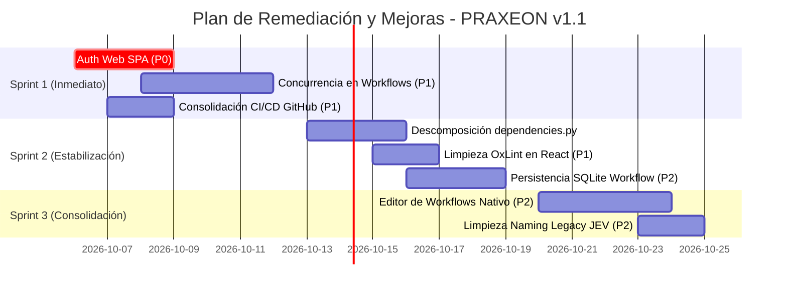

# 🛠️ Informe de Deuda Técnica y Plan de Mejoras: PRAXEON v1.1.0

**Proyecto:** Praxeon (Runtime Supervision & Multi-Agent Coordination Platform)  
**Fecha de Emisión:** 5 de Octubre de 2026  
**Ámbito:** Evaluación técnica post-roadmap (Fases 3 a 8 y mitigación P0–P2)  
**Estado de la Suite:** `765 passed, 1 skipped in 184.95s` (Suite Pytest)  
**Frontend:** `Vite 8.3.1` (Compilación exitosa en 878ms, 0 errores, 119 advertencias OxLint)  
**Empaquetado:** `praxeon-1.0.0-py3-none-any.whl` (Build verificado con activos de la SPA incluidos)

---

## 1. Resumen Ejecutivo de la Deuda Técnica

Tras la implementación de las fases del roadmap y las correcciones de seguridad, **PRAXEON ha cerrado exitosamente las vulnerabilidades y fallos bloqueantes de la v1.0.0**:
- Bypass de autenticación `Fail-Open` (**VULN-01**) corregido.
- Ataques de temporización (**VULN-02**) mitigados con comparaciones de tiempo constante.
- Falsos ataques de repetición (**BUG-01**) resueltos.
- SPA web distribuida correctamente en el paquete Wheel (**BUG-03**).
- Reconciliación determinista de riesgo implementada (**RiskReconciler**), desbloqueando operaciones de inspección (`git status`, `read_file`, `pytest`) hacia `ALLOW`.

No obstante, la rápida expansión del sistema hacia la **orquestación multiagente y workflows personalizados** ha introducido áreas de deuda técnica arquitectónica, concurrencia y experiencia de usuario que deben abordarse antes de un despliegue en entornos comerciales de alta carga.

### Matriz de Priorización de Deuda Técnica

| Área | Nivel de Riesgo | Esfuerzo Estimado | Impacto en Producción |
| :--- | :---: | :---: | :--- |
| **1. Autenticación Web App E2E** | **P0 (Crítico)** | 2-3 días | Impide utilizar la interfaz web en entornos de producción con autenticación activada. |
| **2. Concurrencia Real en Workflows** | **P1 (Alto)** | 3-4 días | Los nodos paralelos (`PARALLEL_FORK`) se evalúan secuencialmente en el runtime actual. |
| **3. Monolito en `dependencies.py`** | **P1 (Alto)** | 2-3 días | Módulo de 2.600+ líneas que ralentiza el mantenimiento y acopla dependencias. |
| **4. Integración CI/CD y Frontend** | **P1 (Alto)** | 1-2 días | Los flujos de GitHub Actions deben estandarizarse en `.github/workflows/` con tests de UI. |
| **5. Advertencias en Frontend (Oxlint)** | **P1 (Alto)** | 1-2 días | 119 advertencias de renderizado en React por llamadas síncronas a `setState` en hooks. |
| **6. Persistencia de Workflows en SQLite** | **P2 (Medio)** | 2 días | Separar el estado de ejecución de la memoria RAM para tolerar reinicios del servidor. |
| **7. Limpieza de Naming Legado (`jev_*`)** | **P2 (Medio)** | 1 día | Coherencia de marca y deprecación formal de identificadores antiguos. |

---

## 2. Desglose Detallado por Áreas Técnicas

---

### 2.1 Seguridad y Control de Acceso (P0)

#### 🔴 DEUDA-SEC-01: Autenticación Web App (SPA) en Producción
* **Problema:**  
  El servidor FastAPI implementa verificación estricta `Fail-Closed`: rechaza con HTTP 401/500 cualquier petición REST o conexión WebSocket si `PRAXEON_PROFILE=production` o la petición proviene de interfaces de red externas y no se proporciona un token válido. Sin embargo, la SPA desarrollada en React (`web/src/services/api.js` y `web/src/services/websocket.js`) realiza llamadas `fetch()` directas y `new WebSocket(...)` sin inyectar credenciales.
* **Impacto:**  
  La aplicación web funciona perfectamente en desarrollo local (`127.0.0.1`), pero queda completamente inaccesible e inoperativa al desplegarse en servidores remotos o bajo perfil de producción.
* **Solución Técnica:**
  1. Diseñar un modal o vista de configuración en la SPA (`SettingsView` / `LoginView`) para capturar la API Key o sesión.
  2. Implementar un endpoint formal de intercambio de credenciales por tickets WebSocket de un solo uso (`AuthService.create_ws_ticket`).
  3. Alternativa enterprise: Autenticación mediante sesión HttpOnly cookie en proxy inverso.

#### 🟡 DEUDA-SEC-02: Aislamiento Físico en Hosts sin Docker
* **Problema:**  
  `LocalProcessSandbox` aplica regex sobre binarios para prevenir escape de egress, pero scripts Python o procesos invocados que abran sockets directamente mantienen acceso irrestricto a la red local y externa en el host. Solo `ContainerSandboxAdapter` garantiza contención de kernel.
* **Solución Técnica:**  
  Exigir `ContainerSandboxAdapter` para cualquier agente que opere con nivel de riesgo `HIGH` o superior en producción, o implementar contención mediante cgroups v2 en Linux / Windows Job Objects.

---

### 2.2 Motor de Workflows y Coordinación Multiagente (P1)

#### 🟠 DEUDA-WF-01: Concurrencia Real en `PARALLEL_FORK` y `PARALLEL_JOIN`
* **Problema:**  
  El modelo de datos [`WorkflowDefinition`](file:///c:/Users/adria/.gemini/antigravity-ide/scratch/jev-llm/jev-reasoning-navigator/praxeon/workflows/models.py) soporta topologías de grafos con ramificaciones paralelas (`NodeType.PARALLEL_FORK` y `NodeType.PARALLEL_JOIN`). No obstante, en [`WorkflowEngine.step()`](file:///c:/Users/adria/.gemini/antigravity-ide/scratch/jev-llm/jev-reasoning-navigator/praxeon/workflows/engine.py), los nodos listos se evalúan secuencialmente dentro de un bucle `for node_id in ready_nodes:`.
* **Impacto:**  
  No existe paralelismo físico real. Si tres agentes tienen tareas asignadas en paralelo, el sistema espera a que cada uno responda o bloquee su turno antes de procesar el siguiente.
* **Solución Técnica:**
  Implementar un scheduler asíncrono con `asyncio.gather()` o un pool de ejecución asíncrono que despache las tareas paralelas concurrentemente a `AgentMessageBus`.

#### 🟠 DEUDA-WF-02: Persistencia Transaccional de `WorkflowExecution`
* **Problema:**  
  Aunque el motor ya separa conceptualmente `WorkflowDefinition` de `WorkflowExecution`, el contexto activo de ejecución (`WorkflowExecutionContext`) reside principalmente en la memoria del proceso.
* **Impacto:**  
  Si el servidor se reinicia o sufre un fallo de proceso durante la ejecución de un workflow de larga duración, el estado de las tareas intermedias y los mensajes en espera (`WAITING_RESULT`) pueden perderse.
* **Solución Técnica:**
  Integrar `WorkflowExecution` en [`SqlitePersistenceStore`](file:///c:/Users/adria/.gemini/antigravity-ide/scratch/jev-llm/jev-reasoning-navigator/praxeon/persistence/sqlite_store.py), realizando checkpoints automáticos en cada transición de estado de nodo (`READY` $\to$ `WAITING_RESULT` $\to$ `COMPLETED`).

#### 🟡 DEUDA-WF-03: Timers y Scheduler en Segundo Plano
* **Problema:**  
  Los campos de `node_retry_after` y `timeout_seconds` registran timestamps de reintento, pero dependen de que un cliente externo o el runner invoque repetidamente `.step()`.
* **Solución Técnica:**  
  Incorporar un worker de fondo en segundo plano (daemon asíncrono de FastAPI) que sondee los workflows activos y despache automáticamente los reintentos que hayan cumplido su tiempo de backoff.

---

### 2.3 Arquitectura y Mantenibilidad del Código (P1)

#### 🟠 DEUDA-ARCH-01: Descomposición del Monolito `dependencies.py`
* **Problema:**  
  [`praxeon/server/dependencies.py`](file:///c:/Users/adria/.gemini/antigravity-ide/scratch/jev-llm/jev-reasoning-navigator/praxeon/server/dependencies.py) cuenta con **2.616 líneas de código**, acumulando lógica de inyección de dependencias, gestión de estado de sesiones, coordinación de decisiones, telemetría y enrutamiento.
  Aunque ya se crearon servicios especializados en [`praxeon/server/services/`](file:///c:/Users/adria/.gemini/antigravity-ide/scratch/jev-llm/jev-reasoning-navigator/praxeon/server/services/) (`auth_service.py`, `decision_service.py`, `mission_service.py`, `session_service.py`), muchas rutas de FastAPI continúan llamando a métodos monolíticos de `RuntimeApplicationService`.
* **Solución Técnica:**
  1. Delegar completamente la lógica de negocio en los servicios de dominio de `praxeon/server/services/`.
  2. Reducir `dependencies.py` a un contenedor liviano de proveedores de FastAPI (`get_session_service()`, `get_auth_service()`, `get_workflow_engine()`).

#### 🟡 DEUDA-ARCH-02: Unificación Canónica del Runtime
* **Problema:**  
  Conviven tres puntos de ejecución: el runtime formal basado en `Navigator`, el interceptor `JEVProxyMiddleware` y el nuevo `AdaptiveRuntime`.
* **Solución Técnica:**  
  Establecer `AdaptiveRuntime` / `RuntimeApplicationService` como el **único control plane** oficial, adaptando `live_agent` y la API REST al mismo flujo de evaluación y ejecución.

---

### 2.4 Frontend Web y Experiencia de Usuario (P1)

#### 🟠 DEUDA-UI-01: Advertencias de React en OxLint (119 Warnings)
* **Problema:**  
  El linter Oxlint reporta 119 advertencias en la carpeta `web/`. El problema más crítico reside en [`MissionChat.jsx`](file:///c:/Users/adria/.gemini/antigravity-ide/scratch/jev-llm/jev-reasoning-navigator/web/src/components/MissionChat.jsx#L227-L263), donde se ejecutan llamadas síncronas a `setMessages((prev) => ...)` dentro del cuerpo de hooks `useEffect`.
* **Impacto:**  
  Provoca re-renderizados en cascada, reduce el rendimiento de la interfaz gráfica y causa omisión de optimizaciones por parte del nuevo compilador de React.
* **Solución Técnica:**
  Refactorizar la gestión de mensajes en `MissionChat.jsx` derivando el estado durante el renderizado o moviendo las actualizaciones a los callbacks de eventos de WebSocket (`onmessage`).

#### 🟡 DEUDA-UI-02: Integración Nativa del Editor de Workflows
* **Problema:**  
  Actualmente, la vista de edición de workflows (`WorkflowsView.jsx`) renderiza un `iframe` que carga `workflow_editor.html` estático.
* **Solución Técnica:**  
  Migrar el editor visual a un componente nativo de React (utilizando librerías como `@xyflow/react` o nodos SVG nativos), compartiendo el mismo estado de Redux/Zustand o Context API del resto de la plataforma.

---

### 2.5 CI/CD, Empaquetado y Calidad (P1 / P2)

#### 🟠 DEUDA-OPS-01: Consolidación de GitHub Actions
* **Problema:**  
  El repositorio mantiene configuraciones históricas en `.ci/` y reglas de exclusión en `.gitignore` que requieren normalización.
* **Solución Técnica:**  
  Consolidar `.github/workflows/test.yml` con una matriz que ejecute:
  ```yaml
  steps:
    - name: Run Backend Tests
      run: python -m pytest -q
    - name: Lint Frontend
      run: npm run lint
      working-directory: web
    - name: Build Frontend
      run: npm run build
      working-directory: web
    - name: Build Wheel
      run: python -m build --wheel
  ```

#### 🟡 DEUDA-OPS-02: Limpieza de Nomenclatura Legada (`jev_*`)
* **Problema:**  
  Persisten identificadores antiguos como `jev_engine.py`, `JEVDashboard`, endpoints `/jev_v2/` y carpetas de caché `.jev_cache/`.
* **Solución Técnica:**  
  Renombrar módulos internos a `praxeon_*`, manteniendo únicamente los comandos CLI (`jev-nav`, `jev-live`, `jev-mcp`) como alias explícitamente marcados como deprecados en la documentación.

---

## 3. Plan de Acción y Hoja de Ruta Priorizada (Sprints)



### Sprint 1: Preparación para Despliegue en Producción (Semana 1)
1. **[P0] Autenticación Web E2E:** Implementar captura de API Key en React y consumo de tickets WebSocket de un solo uso.
2. **[P1] Scheduler Concurrente de Workflows:** Añadir despacho asíncrono concurrente a los nodos `PARALLEL_FORK`.
3. **[P1] Pipeline CI/CD Unificado:** Crear `.github/workflows/test.yml` con validación completa de Python, Node.js y Wheel.

### Sprint 2: Calidad de Código y Resiliencia (Semana 2)
1. **[P1] Modularización del Servidor:** Reducir `dependencies.py` migrando la lógica a `praxeon/server/services/`.
2. **[P1] Saneamiento del Frontend:** Resolver los 119 warnings de OxLint y eliminar llamadas síncronas a `setState` en `MissionChat.jsx`.
3. **[P2] Persistencia de Workflows:** Guardar el estado de `WorkflowExecution` en SQLite para tolerancia a fallos.

### Sprint 3: Experiencia de Usuario y Branding (Semana 3)
1. **[P2] Editor Nativo de Workflows:** Reemplazar el `iframe` por un componente visual React integrado.
2. **[P2] Limpieza de Nomenclatura:** Completar la migración de `jev_*` a `praxeon_*` y limpiar archivos temporales.

---

## 4. Conclusión

El proyecto ha superado con éxito la etapa de prototipo experimental y dispone de una base matemática, criptográfica y de gobernanza de primer nivel, validada por una suite de **765 tests unitarios, de integración y seguridad**.

La deuda técnica identificada en este informe no compromete la integridad del modelo de supervisión, sino que representa los pasos naturales de maduración operativa para transformar PRAXEON en un **producto comercial robusto, escalable y listo para producción**.
